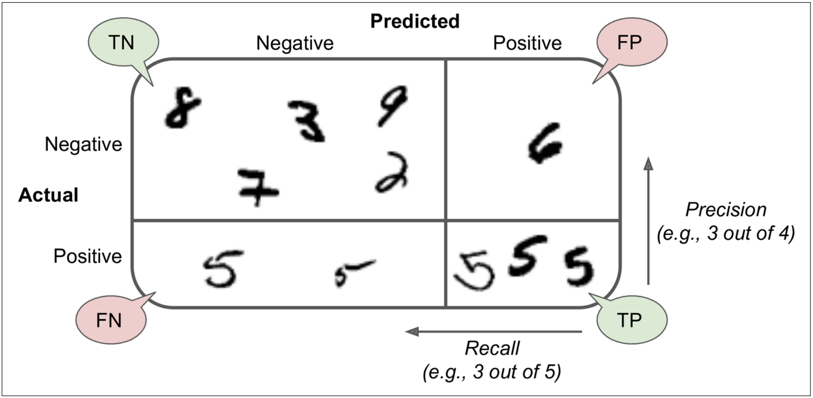

# Notes

## Steps

1. Understand the problem. What's the current solution and what's business objective?
2. Decide whether this is something worth employing ML or a less sofisticated automation job.
3. If positive, choose the right approach by answering few questions
  * Is it supervised, unsupervised or reinforcement learning?
  * Is it a classification or regression task?
  * Is it a batch, online or incremental learning?
4. Select a performance measure for the chosen approach
* Check if the class is imbalanced if is a classification problem
* Decide what to include in the GridSearch
 - Dataset split ratio
 - Whether to use stratified or not
 - Missing data imputation strategy
 - Feature engineering
 - Categorical encoding
 - Hyperparameters

## Data preparation
* Deal with missing data
  - Remove the instances with missing data
  - Remove the columns that have missing data
  - Fill the missing data with a value (zero, the mean, etc.)
* Categorical feature encoding
* Feature selection (choose the best predictors)
  - train faster
  - reduce model complexity (easier to interpret)
  - improves prediction accuracy
  - reduces overfitting
* Feature engineering (create new features, combine existing one)
* Feature scaling
* With classification problems, find the correlation of the class with other features.

## Feature selection
Via "univariate selection". Statistical tests (e.g.  chi-squared test) that select independent features that have the strongest relationship with the target feature.

Via "feature importance" that gives a score for each feature of the dataset. The higher the score the more important or relevant is the feature to in respect of the target one. This is built-in with the tree-based classifiers such as Random Forest and Extra Tree.

Via "Correlation Matrix Heatmap. This shows how features are related to each other and as a consequence with the target one.

High correlation between two features means that they convey the same information. One of them must be removed. If the correlation is with the target feature, that's good, the feature is a strong predictor.

## Feature scaling

### Min-max (a.k.a normalization)

Min-max scaling (many people call this normalization) is quite simple: values are
shifted and rescaled so that they end up ranging from 0 to 1. We do this by subtract‐
ing the min value and dividing by the max minus the min. Scikit-Learn provides a
transformer called MinMaxScaler for this. It has a feature_range hyperparameter
that lets you change the range if you don’t want 0–1 for some reason.

### Standardization

Standardization is quite different: first it subtracts the mean value (so standardized
values always have a zero mean), and then it divides by the variance so that the result‐
ing distribution has unit variance. Unlike min-max scaling, standardization does not
bound values to a specific range, which may be a problem for some algorithms (e.g.,
neural networks often expect an input value ranging from 0 to 1). However, standard‐
ization is much less affected by outliers. For example, suppose a district had a median
income equal to 100 (by mistake). Min-max scaling would then crush all the other
values from 0–15 down to 0–0.15, whereas standardization would not be much affec‐
ted. Scikit-Learn provides a transformer called StandardScaler for standardization.

## Performance measures for regression

Performance measures for regression problems is the so called "cost function". It can be:
* Root Mean Square Error (RMSE) - preferred in general when there are no or few outliers like in a bell-shaped curve
* Mean Absolute Error (MAE) - preferred when there are many outliers (it's less susceptible)

We don't need to scale the target value, but only the other features.

Use the "gradient descent" to find the optimum set of parameters of the hypothesis function.

## Performance measure for logistic regression

We can use a modified cost function and as a consequence gradient descend.

More sophisticated and faster ways to optimize the θ parameters of the hypothesis function are:
- Conjugate gradient
- BFGS
- L-BFGS

## Performance measures for classification

$$accuracy = \frac{correct}{len(pred)}$$

The "accuracy" is generally not the preferred performance measure for classifiers, especially when you are dealing with skewed datasets (i.e. datasets with class imbalance).

### Confusion matrix

A better way to measure the performance of a classification prediction is to look at a confusion matrix (a.k.a. "error matrix"). It's a specific table layout that allows visualization of the performance of an algorithm, typically a supervised learning one (in unsupervised learning it is usually called a matching matrix). Each row of the matrix represents the instances in an actual class while each column represents the instances in a predicted class, or vice versa.

The confusion matrix gives you a lot of information, but sometimes you may prefer a more concise metric.

### Precision and Recall

An interesting one to look at is the accuracy of the positive predictions. This measure is called the "precision" of the classifier

$$precision = \frac{TP}{TP + FP}$$

A trivial way to have perfect precision is to make one single positive prediction and ensure it is correct (precision = 1/1 = 100%). This would not be very useful since the classifier would ignore all but one positive instance. So precision is typically used along with another metric named recall, also called sensitivity or true positive rate (TPR): this is the ratio of positive instances that are correctly detected by the classifier.

$$recall = \frac{TP}{TP + FN}$$

Recap:
* Precision:
* Recall: true positive rate

### F1 score

It is often convenient to combine precision and recall into a single metric called the F1 score, in particular if you need a simple way to compare two classifiers. The F1 score is the harmonic mean of precision and recall (Equation 3-3). Whereas the regular mean treats all values equally, the harmonic mean gives much more weight to low values. As a result, the classifier will only get a high F1 score if both recall and precision are high.

$$F_1 = \frac{2}{\frac{1}{precision} + \frac{1}{recall}} = 2 \cdot \frac{precision \cdot recall}{precision + recall} = \frac{TP}{TP + \frac{FN + FP}{2}}$$

The F1 score favors classifiers that have similar precision and recall. This is not always what you want: in some contexts you mostly care about precision, and in other contexts you really care about recall. For example, if you trained a classifier to detect videos that are safe for kids, you would probably prefer a classifier that rejects many good videos (low recall) but keeps only safe ones (high precision), rather than a classifier that has a much higher recall but lets a few really bad videos show up in your product (in such cases, you may even want to add a human pipeline to check the classifier’s video selection). On the other hand, suppose you train a classifier to detect shoplifters on surveillance images: it is probably fine if your classifier has only 30% precision as long as it has 99% recall (sure, the security guards will get a few false alerts, but almost all shoplifters will get caught).

Unfortunately, you can’t have it both ways: increasing precision reduces recall, and vice versa. This is called the precision/recall tradeoff.

### How to choose

Since the ROC curve is so similar to the precision/recall (or PR) curve, you may wonder how to decide which one to use. As a rule of thumb, you should prefer the PR curve whenever the positive class is rare or when you care more about the false positives than the false negatives, and the ROC curve otherwise. For example, looking at the previous ROC curve (and the ROC AUC score), you may think that the classifier is really good. But this is mostly because there are few positives (5s) compared to the negatives (non-5s). In contrast, the PR curve makes it clear that the classifier has room for improvement (the curve could be closer to the topright corner).

## Multiclass Classification

Multiclass Classifiers (a.k.a. Multinomial Classifiers) can distinguish between more than two classes.

## Multicollinearity

Decision trees and boosted trees algorithms are immune to multicollinearity by nature. When they decide to split, the tree will choose only one of the perfectly correlated features.

Logistic Regression or Linear Regression are not immune to Multicollinearity problems and you should fix it before training the model.

Fix: you can either remove the feature or use dimension reduction algorightm such as Principle Component Analysis (PCA).

## Concepts
* Accuracy
* Precision/Recall curve
* Receiver Operating Characteristic (ROC curve)
* Area Under the Curve (AUC)
* one-versus-all (OvA) strategy (a.k.a. one-versus-the-rest) for binary classifiers
* one-versus-one (OvO) strategy for binary classifiers
* Scikit-Learn "predict_proba()" vs "decision_function()"
* `decision_function()` method returns a score for each instance, and then make predictions based on those scores using any threshold you want

Scikit-Learn classifiers have either `decision_function()` or `predict_proba()` method. The `predict_proba()` method returns an array containing a row per instance and a column per class, each containing the probability that the given instance belongs to the given class.

## Algorithms

Random Forest classifiers or naive Bayes classifiers are capable of handling multiple classes directly.
Support Vector Machine classifiers or Linear classifiers are strictly binary classifiers.
You can also use multiple binary classifiers to perform multiclass classification

## Confirmation Bias

Confirmation bias is the tendency to search for, interpret, favor, and recall information in a way that confirms or supports one's prior beliefs or values.

Specific effects:
- attitude polarization (when a disagreement becomes more extreme even though the different parties are exposed to the same evidence)
- belief perseverance (when beliefs persist after the evidence for them is shown to be false)
- the irrational primacy effect (a greater reliance on information encountered early in a series)
- illusory correlation (when people falsely perceive an association between two events or situations).

People may show confirmation bias because they are pragmatically assessing the costs of being wrong, rather than investigating in a neutral, scientific way.

## Inference methods

Deductive reasoning, or deduction, is making an inference based on widely accepted facts or premises. If a beverage is defined as "drinkable through a straw," one could use deduction to determine soup to be a beverage. Inductive reasoning, or induction, is making an inference based on an observation, often of a sample. You can induce that the soup is tasty if you observe all of your friends consuming it. Abductive reasoning, or abduction, is making a probable conclusion from what you know. If you see an abandoned bowl of hot soup on the table, you can use abduction to conclude the owner of the soup is likely returning soon.
