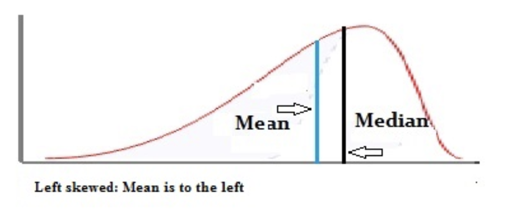

# Statistics and numerical recall

## Mean, median and mode

* The mean is the average of a data set.
* The median is the middle of the set of numbers.
* The mode is the most common number in a data set.

## Skewed distributions

A left-skewed distribution has a long left tail. Left-skewed distributions are also called negatively-skewed distributions. That’s because there is a long tail in the negative direction on the number line. The mean is also to the left of the peak.

A right-skewed distribution has a long right tail. Right-skewed distributions are also called positive-skew distributions. That’s because there is a long tail in the positive direction on the number line. The mean is also to the right of the peak.

In a normal distribution, the mean and the median are the same number while the mean and median in a skewed distribution become different numbers.

A left-skewed, negative distribution will have the mean to the left of the median.

A right-skewed distribution will have the mean to the right of the median.

## Skewness

Is a measure of the distribution of values around the mean.

The tail is longer on one side and in most cases, the mean is to the left of the median for left-skewed distribution or to the right for right-skewed ones. This isn’t a reliable test for skewness though, as some distributions (i.e. many multimodal distributions) violate this rule. You should think of this as a rule of thumb.

## Linear equation

A linear equation is described by $y = \theta_0 + \theta_1X_1$. This equation has only one variable and it is called _"univariate linear equation"_.

A _"multivariate linear equation"_ on the other hand will have more than one variables: $y = \theta_0 + \theta_1X_1 + \theta_2X_2 + ... + \theta_nX_n$

In a univariate linear equation, $\theta_0$ represent the `y-intercept` and $\theta_1$ is the `gradient` (a.k.a. `slope` of the function).
